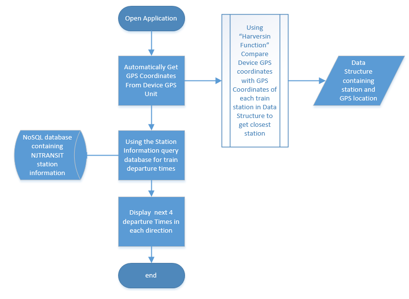

# Project-1: Automatically display NJTRANSIT train departure times.
#### Author: Kieyn Parks
#### Language: Python
#### Database: MongoDB (NoSQL)

This project is a combination the following:
- Engineering and Design
- Database
- Data Structures and Algorithms 

## Project Overview:

This project is in two parts. The first part is the database managment system (DBMS) for a NoSQL database and the second part is the user interface (UI). The DBMS impliments CRUD functionallity for Inserting, deleting, update, and searching of the database. The U.I. interfaces with the user and displays information to the screen.

## User Interface discription:

This application is designed to return the train schedule for New Jersey Transit train system from the database to the user. The goal is that the entire process happens automatically using the GPS location of the user. Once the application is opened the GPS location is grabed from the user's device. The GPS coordinates is used to determine the closest train station to the user with the next 4 departure times going in each direction; this is the top use case for this application. The second use case will be trip planning.

Trip planning is a bit more complicated as it requres the user to input some information, nameley trip starting point and trip ending point no train staion name is neccessary just the town name and the program will workout closest stations possible including all connections to complete the trip.

## Code Review:
Below is a vedio of the code review:

[Code Review](https://www.youtube.com/embed/S5SBJUDnSNw)


## Design & Engineering:
#### Flow Chart: use case 1.

#### Use Case Diagram:


### [LINK - Design and Engineering Narrative](https://github.com/CodeSenpii/CodeSenpii.github.io/blob/master/Design_Engineering.docx)

## Algorithm and Data Structure:
Python offers sevral data structures.
- List
- Sets
- Associative Array/ Dictionary / Maps
- Tuples

The main data structure used in this programs is a **list of tuples** This contains the the name of the stations, the station IDs and the latitude and Longitude coordinates of each train station. Train station names and location hardly ever changes so keeping a data structure with this information embedded in the software save on processing time and database queries.

**Example of the list of tuples.**
```
jersey_coast_line2 = [('Aberdeen Matawan Station', 'AM',  [40.420161,-74.223702]), ('Allenhurst Station','AH', [40.237659,-74.006769]), ('Asbury Park Station',
'AP', [40.215359,-74.014782]),  ('Avenel Station','AV', [40.577620,-74.277530]),('Bay Head Station','BH', [40.077178,-74.046201]),
('Belmar Station','BS', [40.180590,-74.027301]),  ('Bradley Beach Station','BB', [40.203753,-74.018891]), ('Elberon Station','EL',[40.265292,-73.997617]),
('Elizabeth Station','EZ', [40.667859,-74.215171]), ('Hazlet Station','HZ', [40.415385,-74.190393]), ('Little Silver Station','LS', [40.326715,-74.041054]),
('Manasquan Station','SQ', [40.120573,-74.047685]), ('Middletown New Jersey Station','MI', [40.389780,-74.116131]), ('Monmouth Park Station','MK', [40.313427,-74.015172]),
('New York Penn Station','NY', [40.750051,-73.992358]), ('Newark Penn Station','NP', [40.734223,-74.164550]), ('Perth Amboy Station','PE', [40.509398,-74.273752]),
('Point Pleasant Beach Station','PP', [40.092718,-74.048191]), ('Red Bank Station','RB', [40.348284,-74.074535]), ('Secaucus Junction Station','SE', [40.761190,-74.075821]),
('South Amboy Station','CH', [40.48431,-74.28014]), ('Spring Lake Station','LA', [40.150559,-74.035481]), ('Linden Station','LI', [40.629487,-74.251772]),
('Long Branch Station','LB', [40.297145,-73.988331]), ('Woodbridge Station','WB', [40.55661,-74.27775]), ('EWR Newark Airport Station','NA', [40.704417,-74.190714])]
```
Another data structure used in this project is **Python Dictionary.**
This dictionary is used to convert 2 digit military time (type: "text") to  military (type: Integer)

**Example of python Dictionary.**
```
time_map_local = {'00':0, '01':1, '02':2, '03':3, '04':4, '05':5, '06':6, '07':7, '08':8,
                  '09':9, '10':10, '11':11, '12':12, '13':13, '14':14, '15':15, '16':16, '17':17,
                  '18':18, '19':19, '20':20, '21':21, '22':22, '23':23}

```
### [LINK - Algorithm and Data Structure Narrative](https://github.com/CodeSenpii/CodeSenpii.github.io/blob/master/Narrative_ADS.docx)

## Database:
The database used in this project is a MongoDB NoSQL. A Database managment system application written in python is used to Insert, Update, Delete and Search the database (njtransit).
# NJTRANSIT DATABASE MANAGMENT SYSTEM
```
#------------------------------------------------------------------------------------
'''
*  This program demonstrates the use of CRUD functions that insert, update and delete
*  a document on the Mongodb NoSql database
'''
#-----------------------------------------------------------------------------------

from pymongo import MongoClient
import json
from bson import json_util
import datetime
from collections import OrderedDict

#the database is "market" and the collection is "stocks"
connection = MongoClient('localhost', 27017)
db = connection['njtransit']
collection = db['schedule']

fields = ["line", "station_name", "station_id", "coordinates", "departure_time"]

# collect the data from the user
def createDocumnet():
    
    print("****INSERT DOCUMENT****")
    values = [] # hold the values for the key:value pairs
    value = ""
    lat = 0.0   # laitude
    long = 0.0   # longitude
        
    #get the keys from the key array 
        
    for key in fields:
        # read  the values from user keyboard and append to values array
        # all values captured as strings
        if key != 'coordinates' and key != 'departure_time':                                
            value = input('Enter ' + key + ': ') 
            values.append(value)
        elif key == 'coordinates':
            lat = input('Enter latitude' + ': ') 
            long = input('Enter longitude' + ': ')                
        elif key == "departure_time":
            times_nb = ""
            times_sb = ""
            print("\nEnter North-Bound or South-Bound times when prompted **leave a space between times**")
            print("\n*******************IMPORTANT NOTICE: DATA ENTRY FORMAT*******************")
            print("\nData Entry Example: 9:13am 9:20am 10:30am... hit -ENTER- key when done!")
            print("\n********************************END**************************************")
                
            times_nb = input("\nEnter **NORTH-BOUND** times! Press ENTER key to submit:")
            times_sb = input("Enter **SOUTH-BOUND** times! Press ENTER key to submit:")
                
            print("This is what you entered!")
            print("North-Bound: " + times_nb, "\nSouth-Bound: " + times_sb)
                
            # TODO get a confirmation that the info is good or bad
                
            times_nb = times_nb.split(' ')
            times_sb = times_sb.split(' ')
            
    document = {}
    document["line"] = values[0]
    document["station_name"] = values[1]
    document["station_id"] = values[2]
    document["coordinates"] = {"latitude" : lat, "longitude" : long}
    document["departure_time"] = {"north_bound" : times_nb, "south_bound" : times_sb}
            
    return document        
    
#*******************insert a document ******************************
def insertDocument(document):
    try:
        result = collection.insert_one(document)
        print("Data insert successfull")
    except ValidationError as ve:
        abort(400, str(ve))
        print("Data insert fail")
    return result # return TODO

#delete a document
def deleteDocument():
    print("WARNING! You are about to delete a document!")
    station_id = input("Enter station id: ")
    doc_delete = {"station_id" : station_id}
    try:
        doc = collection.delete_one(doc_delete)
        if doc.delete_count > 0:
            print("document deleted")
        else:
            print("No documents deleted!")
                
    except InvalidOperation as iv:
        print("ERROR: " + iv)
    pass

# update docments in the collection
def updateDocument():
    station_id = input("Enter station id: ")
    search = {"station_id" : station_id}
    
    field = input("Enetr field to update: ")
    value = input("Enter value: ")
    
    newValue = {"$set" : {field : value}}
    
    try:
        update = collection.update_one(search, newValue)
        print("update completed")
        
    except:
        print("update failed!")
        
# Search database for station
def searchDocument():        
    exit = False
    while not exit:
        
        try:
            menu = "1) Find by station name. \n2) Find by station id."
            print(menu)
            option = int(input("Option: "))
            if option == 1:
                station = input('Enter station name: ')
                doc = collection.find_one({"station_name" : station})
                exit = True
                return doc
            elif option == 2:
                station_id = input('Enter station id: ')
                doc = collection.find_one({"station_id" : station_id})
                exit = True
                return doc
            else:
                doc = "No Search String Entered!"                
                return doc
        except:
            
            print('Error occured\n')
            pass

# program starts here
def main():
    #menu options
    menu = "Choose and operation. \n1) Insert Documents. \n2) Search Documents.\n3) Delete a Document."
    print(menu)
    option = "0"
    
    #parse option input should be integer only
    while option.isdigit():
        try:
            option = int(input("Choose Option (1-4): "))
            break;
        except:
            print("Invalid selection!")

    #creating the document   
    if option == 1:
        document = createDocumnet()
        #print(insertDocument(document))
        print(document)
            
    elif option == 2:
        document = searchDocument()
        print(document)
        
    elif option == 3:
        deleteDocument()
        
    elif option == 4:
        updateDocument()       
    else:
        pass
                
if __name__ == '__main__':
           main()

```
### [LINK - Database Narrative](https://github.com/CodeSenpii/CodeSenpii.github.io/blob/master/DBS.docx)


### Markdown

Markdown is a lightweight and easy-to-use syntax for styling your writing. It includes conventions for

```markdown
Syntax highlighted code block

# Header 1
## Header 2
### Header 3

- Bulleted
- List

1. Numbered
2. List

**Bold** and _Italic_ and `Code` text

[Link](url) and 
```

For more details see [GitHub Flavored Markdown](https://guides.github.com/features/mastering-markdown/).

### Jekyll Themes

Your Pages site will use the layout and styles from the Jekyll theme you have selected in your [repository settings](https://github.com/CodeSenpii/CodeSenpii.github.io/settings). The name of this theme is saved in the Jekyll `_config.yml` configuration file.

### Support or Contact

Having trouble with Pages? Check out our [documentation](https://help.github.com/categories/github-pages-basics/) or [contact support](https://github.com/contact) and we’ll help you sort it out.
